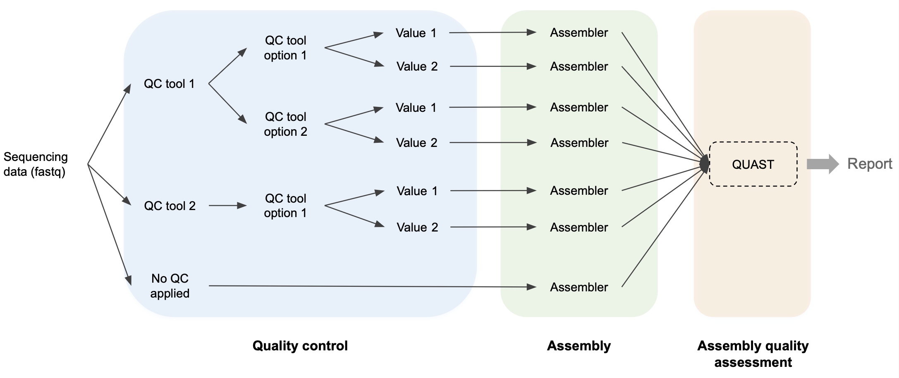

## Introduction

**QCbench** is a flexible benchmarking framework built with Nextflow and based on the nf-core ecosystem. It benchmarks user-provided quality control (QC) tools and parameter settings in genome sequencing workflows.

QCbench integrates user-defined QC tools and their command-line options into the benchmarking pipeline through a configuration file. Currently, it is limited to tools available as nf-core modules. This allows users to test multiple QC tools and their parameters and assemblers without modifying pipeline code. The benchmarking pipeline runs each QC tool/parameter combination, assembles the processed reads, and evaluates assembly quality using QUAST, which computes various quality metrics and summarises them in reports, thus providing a structured comparison across all tested configurations.



By automatically integrating QC tools into the benchmarking pipeline based on user configuration, QCbench simplifies the creation of customized benchmarking workflows, enabling the selection and optimization of QC tools and parameters for specific experiments.

## Usage
> If you are new to Nextflow and nf-core, please refer to [this page](https://nf-co.re/docs/usage/installation) on how to set-up Nextflow.

> See the [usage documentation](docs/usage.md) for detailed instructions.

### 1. Prepare the [samplesheet](data/samplesheet.csv)

First, prepare a samplesheet with your input data that looks as follows for single-end reads:

`samplesheet.csv`:

```csv
sample,fastq_1
sample1,sample1.fastq.gz
sample2,sample2.fastq.gz
```

Each row represents a sample with the sample ID, the path to the respective FASTQ file. For paired-end reads, add a column `fastq_2` and fill out the samplesheet accordingly.

### 2. Configure the QC tools and assembler in the [modules.yml](conf/modules.yml)
QCbench uses a YAML configuration file (`config/qc_tools.yml`) to define which QC tools and parameters to benchmark and which assembler to use.

Here, an example configuration block for the QC tool `chopper` is shown:
```yaml
chopper: # name of the nf-core module
  enabled: true
  type: "nf-core"
  output_name: "fastq"
  options:
    - option: "--quality" # command-line option to benchmark
      values: [13, 15] # list of values to test for this option
      additional_options: "-l 1000" # options always included (not varied)
    - option: "--maxgc"
      values: [0.8]
      additional_options: "-l 1000"
  extra_inputs:
    - name: "fasta"
      type: "path" # "path", "val", or "tuple"
      value: "[]"
```

### 3. Generate pipeline code
Based on the configuration in the `modules.yml` file, QCbench determines which modules need to be installed from `nf-core` and automatically generates the necessary code to integrate and invoke these modules within the pipeline. Both, the module installation and code generation, are automated when you execute the following command:

```bash
# Run this command from the project root
./qcbench.sh generate
```

Minor adjustments in the code may be required. See the [usage documentation](docs/usage.md) for detailed instructions.

### 4. Execute the pipeline

```bash
# Run this command from the project root
./qcbench.sh execute -profile singularity
```

## Output
The final step of the pipeline is the execution of [`QUAST`](https://github.com/ablab/quast), which evaluates the quality of the assembled genome. QUAST generates a comprehensive report that provides insights into the accuracy and completeness of the assembly. This report includes various metrics such as contig counts, N50, GC content, and alignment statistics against the reference genome (if provided). For more information about QUAST reports, see <https://quast.sourceforge.net/docs/manual.html>.

Upon completion of the pipeline, the QUAST reports can be found in the directory `<OUTDIR>/quast`. The directory will contain separate subdirectories for each sample, with an individual QUAST report generated for each sample.

**Example**
```
qcbench                  # this project
├── ...
└── results              # --outdir is set to "results"
     ├── ...
     └── quast
          ├── sample1
          └── sample2

```

## Citations
An extensive list of references for the tools used by the pipeline can be found in the [`CITATIONS.md`](CITATIONS.md) file.

This pipeline uses code and infrastructure developed and maintained by the [nf-core](https://nf-co.re) community, reused here under the [MIT license](https://github.com/nf-core/tools/blob/master/LICENSE).

> **The nf-core framework for community-curated bioinformatics pipelines.**
>
> Philip Ewels, Alexander Peltzer, Sven Fillinger, Harshil Patel, Johannes Alneberg, Andreas Wilm, Maxime Ulysse Garcia, Paolo Di Tommaso & Sven Nahnsen.
>
> _Nat Biotechnol._ 2020 Feb 13. doi: [10.1038/s41587-020-0439-x](https://dx.doi.org/10.1038/s41587-020-0439-x).
>
> In addition, references of tools and data used in this pipeline are as follows:
