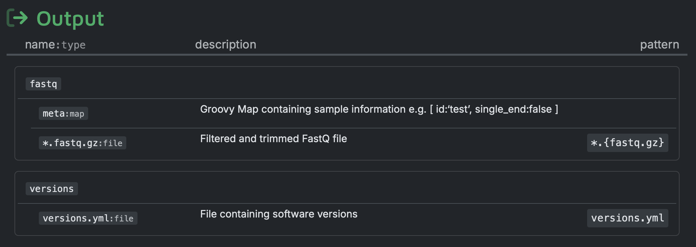
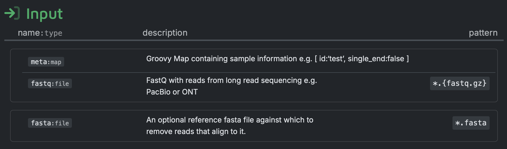

# QCbench: Usage
> If you are new to Nextflow and nf-core, please refer to [this page](https://nf-co.re/docs/usage/installation) on how to set-up Nextflow. Furthermore we have used [nf-test](https://www.nf-test.com) to write pipeline tests and [Apptainer](https://apptainer.org) as container system.

## 1. Prepare the [samplesheet](../data/samplesheet.csv)

You will need to create a samplesheet with information about the samples you would like to analyse before running the pipeline. It has to be a comma-separated file with at least 2 columns, and a header row as shown in the example below.

### Full samplesheet

| Column    | Description                                                                                                                                                                            |
| --------- | -------------------------------------------------------------------------------------------------------------------------------------------------------------------------------------- |
| `sample`  | Custom sample name. |
| `fastq_1` | Full path to FastQ file for reads 1. File has to be gzipped and have the extension ".fastq.gz" or ".fq.gz". Required.|
| `fastq_2` | Full path to FastQ file for reads 2 in case of paired-end reads. File has to be gzipped and have the extension ".fastq.gz" or ".fq.gz". Optional.|

**Example `samplesheet.csv`**

In this case, single-end reads are provided, so that `fastq_2` is omitted.
```csv
sample,fastq_1
sample1,data/sample1.fastq.gz
sample2,data/sample2.fastq.gz
```

Each row represents a sample with its corresponding FastQ file path.

## 2. Configure the QC tools and assembler in the [modules.yml](../conf/modules.yml)
QCbench uses a YAML configuration file (`config/qc_tools.yml`) to define which QC tools and parameters to benchmark and which assembler to use. You can enable/disable tools and add new ones without pipeline code changes.

The file is divided into a `qc_tools` and an `assembler` section. These sections contain configuration blocks representing the tools to be included in the pipeline. While multiple QC tools can be enabled and benchmarked against each other, only one assembler is integrated into the pipeline. If multiple assemblers are configured and enabled, only the first assembler configuration block will be used.

> Note: Please be aware that QCbench currently supports only nf-core modules. The following guide on configuring tools assumes that the tools being integrated are available as nf-core modules.

### Example configuration block
The following guide uses the QC tool [`chopper`](https://github.com/wdecoster/chopper) as an example.

```yaml
chopper: # name of the nf-core module
  enabled: true
  type: "nf-core"
  output_name: "fastq"
  options:
    - option: "--quality"
      values: [13, 15]
      additional_options: "-l 1000"
    - option: "--maxgc"
      values: [0.8]
      additional_options: "-l 1000"
  extra_inputs:
    - name: "fasta"
      type: "path"
      value: "[]"
```
| Key    | Type | Description |
| --------- | ------------ | ------------ | 
| `enabled`  | `true` or `false` | Specifies whether the tool should be included in the pipeline. |
| `type` | `local` or `nf-core` | Indicates whether the tool is available as a `local` or an `nf-core module`. As mentioned before, this guide assumes that the tool is available as `nf-core module`. |
| `output_name` | `string` | Specifies the name of the output channel that contains the preprocessed reads, which is specific for each tool |
| `options`        | `list` of objects | A list of command-line options to benchmark. Each object contains:                             |
|                  |                   | `option`: The command-line option to test as `string` (e.g., `"--quality"`)                              |
|                  |                   | `values`: A list of values to test for the option (e.g., `[13, 15]`)                       |
|                  |                   | `additional_options`: Options always included but not varied             |
| `extra_inputs`   | `list` of objects | A list of additional inputs required by the tool. Each object contains:                        |
|                  |                   | `name`: A descriptive name for the input                                    |
|                  |                   | `type`: The type of input (`path`, `val`, or `tuple`)                                  |
|                  |                   | `value`: The value of the input (e.g., `[]` for an empty file path)              |

### Gathering information for configuration
The following sections explain how to gather the necessary information to configure the chopper module as shown above.

#### nf-core modules documentation
The nf-core module documentation for chopper can be found here: https://nf-co.re/modules/chopper/.

There you can find the following information:

##### `output_name`

In this case the name of the output channel that contains the preprocessed reads is "fastq".

##### `extra_inputs`

QCbench requires QC tools to accept a tuple consisting of a meta map and the path to the reads as input, which is compatible with chopper (and most of the other QC tools). However, chopper also requires a second input, a reference `fasta` file, which must be specified in the module configuration under `extra_inputs`.

Specify the `value` as a string, using the same syntax you would use in a Nextflow script.

According to the description, the reference fasta file is optional. Therefore, the example configuration uses an empty file path as `value`, represented as `[]` in Nextflow. If you want to provide the reference fasta file, you would use the `file()` method in Nextflow. Thus, in the configuration, you would write `value: "file(path_to_file)"`.

#### Command-line tool documentation
The documentation for chopper can be found here: https://github.com/wdecoster/chopper.

There you can find the following information:

##### `options`
In the chopper documentation you can find the command-line options available for chopper. These are the filtering options:
```
Filtering Options:
  -q, --quality <MINQUAL>
          Sets a minimum Phred average quality score
          [default: 0]

      --maxqual <MAXQUAL>
          Sets a maximum Phred average quality score
          [default: 1000]

  -l, --minlength <MINLENGTH>
          Sets a minimum read length
          [default: 1]

      --maxlength <MAXLENGTH>
          Sets a maximum read length
          [default: INF]

      --mingc <MINGC>
          Filter min GC content

      --maxgc <MAXGC>
          Filter max GC content
...
```
In the example configuration, we want to try the `quality` filtering and the `maxgc` filtering option of chopper in the benchmarking. Additionally, we want to include another chopper option (`-l 1000`) alongside the filtering options being benchmarked.

The options (`--quality` and `--maxgc`), their values and the additional options (`-l 1000`) are specified under `options`, where each option is configured as one object. Since we are testing two different values for `quality` filtering and one value for `maxgc` filtering, the following chopper executions will be performed:
```bash
chopper ... −l 1000 −−quality 13
chopper ... −l 1000 −−quality 15
chopper ... −l 1000 −−maxgc 0.8
```

## 3. Generate pipeline code

Based on the configuration in the `modules.yml` file, QCbench identifies which modules need to be installed from `nf-core` and automatically generates the code needed to integrate and invoke these modules within the pipeline. Both module installation and code generation are automated when you run the following command from the project root:

```bash
./qcbench.sh generate
```

After execution, the module code will be located under [modules/nf-core](../modules/nf-core/), and the modules.config and main.nf files will be generated, as shown below.

```
qcbench
├── conf
|    └── modules.config     # module configuration
├── modules
|    └── nf-core
|         └── chopper       # module code
└── subworkflows
|    └── local
|         └── module_executor_helper
|              └── main.nf  # contains module invokation
```

### Adjustments to [modules.config](../conf/modules.config)
After the code generation, minor adjustments to the `modules.config` file may be required. To verify this, the module code should be reviewed. This is a code snippet from the chopper module code:
```bash
    zcat \\
        $args \\
        $fastq | \\
    chopper \\
        --threads $task.cpus \\
        $fasta_filtering \\
        $args2 | \\
    gzip \\
        $args3 > ${prefix}.fastq.gz

```

The chopper command-line options are written to the `ext.args2` key, as shown in the chopper process code. The `ext.args` key is used for `zcat` options. However, the code generation defaults to writing tool options to `ext.args`. To ensure correct execution, you need to update the `modules.config` file by changing `ext.args` to `ext.args2` for the chopper module.

## 4. Running the pipeline
### Pipeline validation
You can test your setup with `-profile test` before running the workflow on actual data. The `test` profile runs a minimal test, using a small dataset to quickly verify that the pipeline is working as expected with your setup. Provide a small dataset in the [data/test-datasets](../data/test-datasets) directory and fill out the samplesheet. 

Run the following command from the project root:

```bash
./qcbench.sh execute -profile test,singularity
```
or
```bash
nextflow run . -profile test,singularity
```

### Pipeline run
To run the pipeline from the project root, use the following minimal command:
```bash
./qcbench.sh execute -profile singularity
```
Alternatively, you can execute the pipeline directly with Nextflow, bypassing the wrapper script:
```bash
nextflow run . -profile singularity
```

**Required parameters**
| Parameter | Description |
| --------- | ------- |
| `-profile <PROFILE>` | Configuration profile; available options include `singularity`, `docker`, `conda`, among others. For this pipeline, `singularity` is recommended, as the pipeline was developed and tested using this profile. See [below](#core-nextflow-arguments) for more information about profiles. |

**Optional parameters**
| Parameter | Description |
| --------- | ------- |
| `--input <PATH/TO/SAMPLESHEET.CSV>` | Path to the samplesheet. Only required if it is not located at `data/samplesheet.csv`. |
| `--outdir <OUTDIR>` | The output directory where the results will be saved. Defaults to `results` if not provided. |
| `--quast_refseq <PATH/TO/REFERENCE_GENOME>` | Path to reference genome file |
| `--quast_features <PATH/TO/GENOMIC_FEATURES>` | Path to file with genomic feature positions in the reference genome; valid file formats are described in the [QUAST manual](https://quast.sourceforge.net/docs/manual.html#sec2.2) |


Note that the pipeline will create the following files in your working directory:

```bash
work                # Directory containing the nextflow working files
<OUTDIR>            # Finished results in specified location (defined with --outdir)
.nextflow_log       # Log file from Nextflow
# Other nextflow hidden files, eg. history of pipeline runs and old logs.
```

## Core Nextflow arguments

> These options are part of Nextflow and use a _single_ hyphen (pipeline parameters use a double-hyphen).

### `-profile`

Use this parameter to choose a configuration profile. Profiles can give configuration presets for different compute environments.

Several generic profiles are bundled with the pipeline which instruct the pipeline to use software packaged using different methods (Docker, Singularity, Podman, Shifter, Charliecloud, Apptainer, Conda) - see below.

> For this pipeline, `singularity` is recommended, as the pipeline was developed and tested using this profile.

Note that multiple profiles can be loaded, for example: `-profile test,singularity` - the order of arguments is important!
They are loaded in sequence, so later profiles can overwrite earlier profiles.

If `-profile` is not specified, the pipeline will run locally and expect all software to be installed and available on the `PATH`. This is _not_ recommended, since it can lead to different results on different machines dependent on the computer enviroment.

- `test`
  - A profile with a complete configuration for automated testing
  - Includes links to test data so needs no other parameters
- `docker`
  - A generic configuration profile to be used with [Docker](https://docker.com/)
- `singularity`
  - A generic configuration profile to be used with [Singularity](https://sylabs.io/docs/)
- `podman`
  - A generic configuration profile to be used with [Podman](https://podman.io/)
- `shifter`
  - A generic configuration profile to be used with [Shifter](https://nersc.gitlab.io/development/shifter/how-to-use/)
- `charliecloud`
  - A generic configuration profile to be used with [Charliecloud](https://hpc.github.io/charliecloud/)
- `apptainer`
  - A generic configuration profile to be used with [Apptainer](https://apptainer.org/)
- `wave`
  - A generic configuration profile to enable [Wave](https://seqera.io/wave/) containers. Use together with one of the above (requires Nextflow ` 24.03.0-edge` or later).
- `conda`
  - A generic configuration profile to be used with [Conda](https://conda.io/docs/). Please only use Conda as a last resort i.e. when it's not possible to run the pipeline with Docker, Singularity, Podman, Shifter, Charliecloud, or Apptainer.

### `-resume`

Specify this when restarting a pipeline. Nextflow will use cached results from any pipeline steps where the inputs are the same, continuing from where it got to previously. For input to be considered the same, not only the names must be identical but the files' contents as well. For more info about this parameter, see [this blog post](https://www.nextflow.io/blog/2019/demystifying-nextflow-resume.html).

You can also supply a run name to resume a specific run: `-resume [run-name]`. Use the `nextflow log` command to show previous run names.

### `-c`

Specify the path to a specific config file (this is a core Nextflow command). See the [nf-core website documentation](https://nf-co.re/usage/configuration) for more information.

<!-- TODO: notwendig oder löschen? -->
## Custom configuration

### Resource requests

Whilst the default requirements set within the pipeline will hopefully work for most people and with most input data, you may find that you want to customise the compute resources that the pipeline requests. Each step in the pipeline has a default set of requirements for number of CPUs, memory and time. For most of the steps in the pipeline, if the job exits with any of the error codes specified [here](https://github.com/nf-core/rnaseq/blob/4c27ef5610c87db00c3c5a3eed10b1d161abf575/conf/base.config#L18) it will automatically be resubmitted with higher requests (2 x original, then 3 x original). If it still fails after the third attempt then the pipeline execution is stopped.

To change the resource requests, please see the [max resources](https://nf-co.re/docs/usage/configuration#max-resources) and [tuning workflow resources](https://nf-co.re/docs/usage/configuration#tuning-workflow-resources) section of the nf-core website.

### Custom Containers

In some cases you may wish to change which container or conda environment a step of the pipeline uses for a particular tool. By default nf-core pipelines use containers and software from the [biocontainers](https://biocontainers.pro/) or [bioconda](https://bioconda.github.io/) projects. However in some cases the pipeline specified version maybe out of date.

To use a different container from the default container or conda environment specified in a pipeline, please see the [updating tool versions](https://nf-co.re/docs/usage/configuration#updating-tool-versions) section of the nf-core website.

### Custom Tool Arguments

A pipeline might not always support every possible argument or option of a particular tool used in pipeline. Fortunately, nf-core pipelines provide some freedom to users to insert additional parameters that the pipeline does not include by default.

## Running in the background

Nextflow handles job submissions and supervises the running jobs. The Nextflow process must run until the pipeline is finished.

The Nextflow `-bg` flag launches Nextflow in the background, detached from your terminal so that the workflow does not stop if you log out of your session. The logs are saved to a file.

Alternatively, you can use `screen` / `tmux` or similar tool to create a detached session which you can log back into at a later time.
Some HPC setups also allow you to run nextflow within a cluster job submitted your job scheduler (from where it submits more jobs).

## Nextflow memory requirements

In some cases, the Nextflow Java virtual machines can start to request a large amount of memory.
We recommend adding the following line to your environment to limit this (typically in `~/.bashrc` or `~./bash_profile`):

```bash
NXF_OPTS='-Xms1g -Xmx4g'
```
